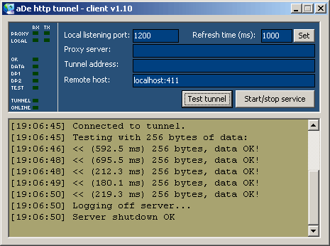



## HTTP Proxy Tunnel

### Description

Pass through regular TCP in a http proxy. This will emulate a normal TCP connection through a HTTP Proxy server, for instance inside a corporate LAN. Works for single outgoing TCP connection only. This software is highly experimental and not particularly functional. Updated 2003-10-31: Added 'Test tunnel' functionality: Tests speed of connection to tunnel.
 
### More Info
 
Proxy server load, angry proxy administrators

             |
---                |---
**Submitted On**   |2003-10-29 21:30:08
**By**             |[aDe\_n](https://github.com/Planet-Source-Code/PSCIndex/blob/master/ByAuthor/ade-n.md)
**Level**          |Advanced
**User Rating**    |4.7 (14 globes from 3 users)
**Compatibility**  |VB 6\.0
**Category**       |[Internet/ HTML](https://github.com/Planet-Source-Code/PSCIndex/blob/master/ByCategory/internet-html__1-34.md)
**World**          |[Visual Basic](https://github.com/Planet-Source-Code/PSCIndex/blob/master/ByWorld/visual-basic.md)
**Archive File**   |[HTTP\_Proxy16653810312003\.zip](https://github.com/Planet-Source-Code/ade-n-http-proxy-tunnel__1-49438/archive/master.zip)

